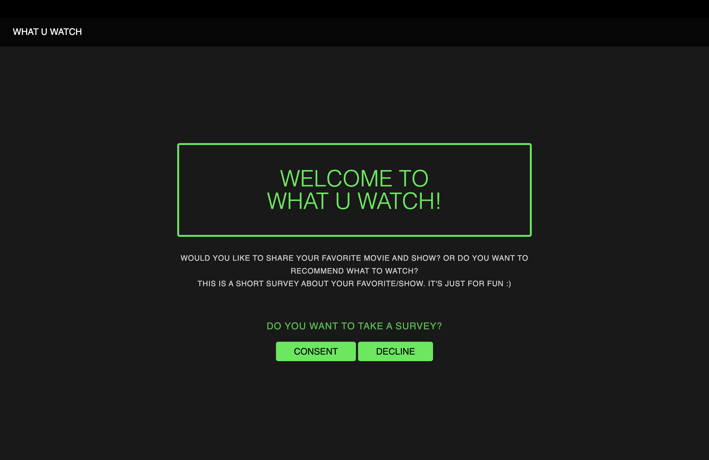
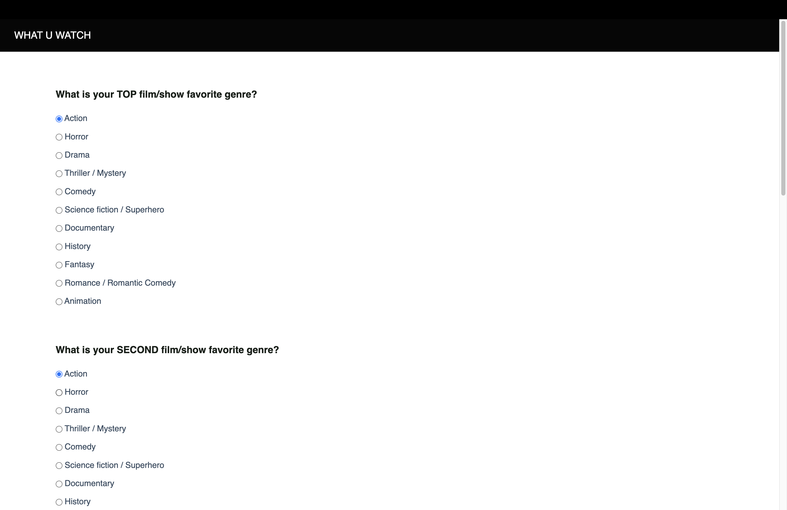
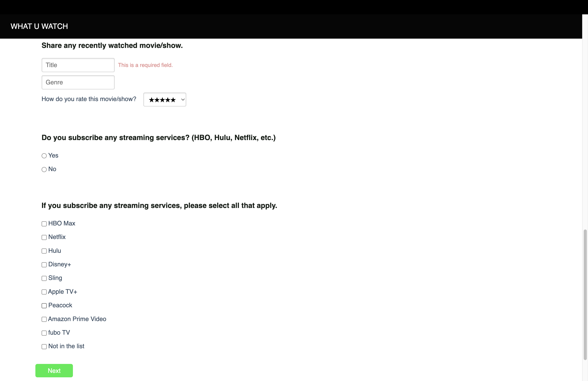
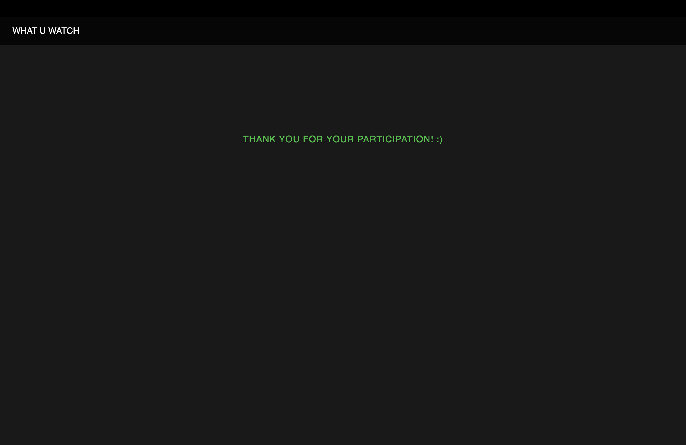

# Servey server

## About the project

This full-stack web application is designed to collect survey responses.

## Technologies

* Built with
Python, Flask, SQL(PostgreSQL), Javascript, HTML/CSS, Jinja, and PureCSS

* Deployed with
Render (https://render.com/)

## Link to Site
<https://sol-survey.onrender.com/>

* Link to a JSON representation of all collected survey responses:\
https://sol-survey.onrender.com/api/results

* Link to the collected text responses:\
https://sol-survey.onrender.com/admin/summary

## 